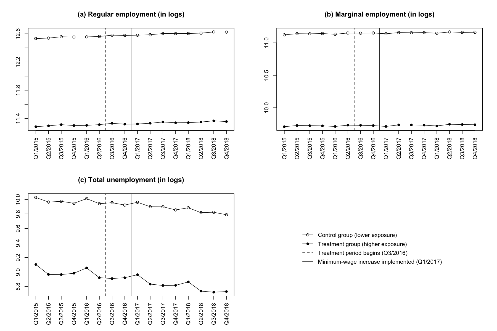
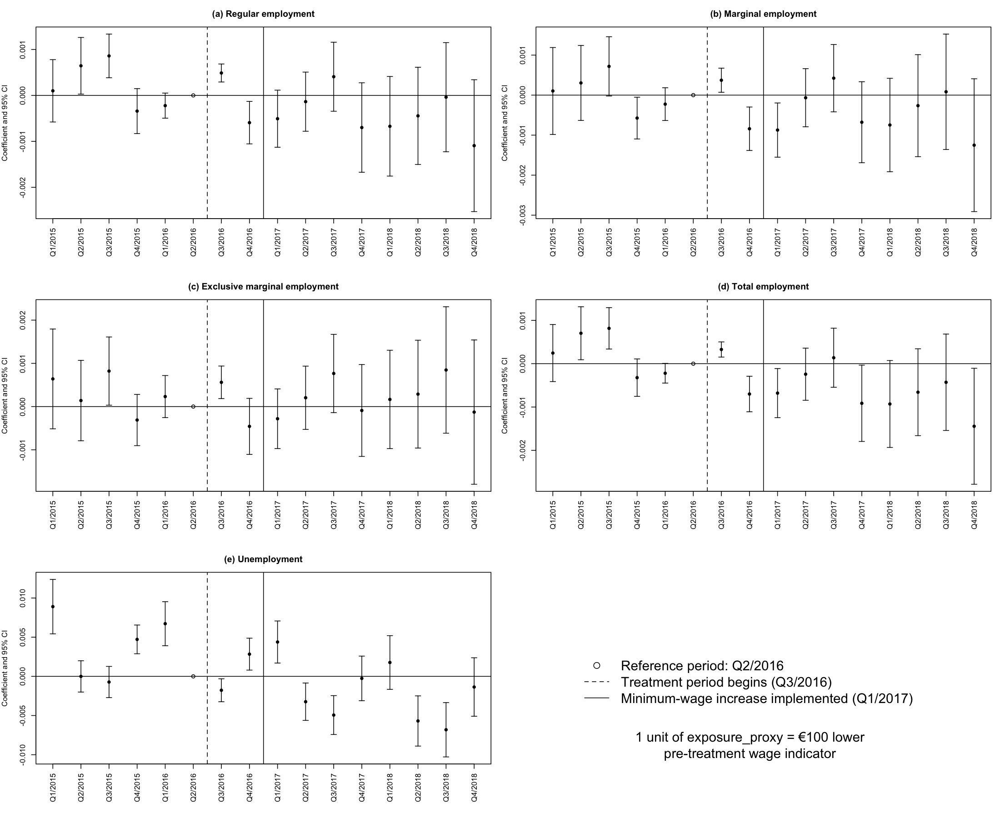

# The 2017 German Minimum Wage Increase and Regional Labor Market Outcomes

## 1. Research Question

This project examines regional labor market developments around the 2017 increase in the German statutory minimum wage. Building on my replication of  Bonin et al. (2020), I investigate whether regions with higher expected 
minimum-wage exposure experienced different post-treatment developments in employment and unemployment outcomes.

The replication is available in a [separate repository](https://github.com/dorian-kenfack/german-minimum-wage-replication).
This repository contains the independent extension and its associated data, code, and results.

## 2. Data

For the analysis, I constructed a quarterly panel dataset covering the period from 2015 to 2018. The dataset includes all 257 German labor market regions (Arbeitsmarktregionen, AMRs) and five labor market outcomes: (A) regular employment, (B) marginal employment, (C) exclusive marginal employment, (D) total employment, and (E) unemployment.

Regular employment refers to employment subject to social security contributions. Marginal employment includes both exclusively marginal employment and marginal employment held alongside a main job subject to social security contributions. Exclusive marginal employment covers individuals employed exclusively in marginal employment. The combined employment measure (“total employment”) is defined as the sum of regular and exclusively marginal employment, avoiding double-counting individuals who also hold a marginal side job. It does not cover all forms of employment, such as self-employment. Employment counts are measured at the place of work. Unemployment refers to the number of
registered unemployed persons across both legal spheres (SGB II and SGB III).

The labor market data were obtained primarily from the German Federal Employment Agency (Bundesagentur für Arbeit). Additional regional data were used to construct the minimum-wage exposure proxy and the control variables. The 2014 regional wage gap provided by Bonin et al. (2020) is used to validate the exposure proxy constructed for this project.

## 3. Measuring Minimum-Wage Exposure

A measure of regional minimum-wage exposure is required because the 2017 minimum-wage increase did not generate a natural treatment and control group. Bonin et al. (2020) measure regional exposure using a wage gap based on the 2014 German Structure of Earnings Survey. However, an equivalent wage-gap measure cannot be directly reconstructed for the
period preceding the 2017 increase because the required individual-level wage data are not publicly available.

I therefore construct a proxy for regional minimum-wage exposure based on pre-treatment median wages. Using district-level (Kreis) median wages as of December 31, 2015, I calculate an employment-weighted average of district-level median wages for each of the 257 labor market regions (AMRs). This measure is denoted as `amr_proxy`.

To assess whether regional median wages provide a meaningful proxy for minimum-wage exposure, I reconstruct the same measure using pre-treatment data from 2013 and compare it with the original 2014 wage gap reported by Bonin et al. (2020). The relationship is clearly nonlinear, and a quadratic specification explains approximately 70% of the cross-regional variation in the original wage gap. The estimated pattern is also economically plausible: regions with higher median wages tend to exhibit smaller wage gaps and therefore lower minimum-wage exposure. This historical association provides supportive evidence for the use of the wage-based measure as a proxy for regional minimum-wage
exposure. However, its transferability to the 2017 minimum-wage increase cannot be directly verified and therefore remains an assumption  underlying the exposure measure.

For a more intuitive interpretation of the continuous estimates, I reverse the sign of the proxy and rescale it into €100 units:

`exposure_proxyᵢ = - (amr_proxyᵢ / 100)`

Thus, a one-unit increase in exposure_proxy corresponds to a €100 lower pre-treatment median wage indicator and therefore to higher expected minimum-wage exposure.

[View the historical validation of the wage-based exposure proxy](figures/proxy_validation.png).

## 4. Empirical Strategy

*Treatment timing.* The minimum-wage increase was announced on June 28, 2016, at the end of Q2/2016. I therefore define Q3/2016 as the beginning of the treatment period rather than the actual implementation date of January 1, 2017, since firms may have adjusted in anticipation of the increase.

*Binary treatment definition.* `Treatmentᵢ = 1` for AMRs with a pre-treatment median wage below the median across all AMRs, corresponding to higher expected minimum-wage exposure. `Treatmentᵢ = 0` otherwise. The comparison group therefore consists of relatively lower-exposure regions rather than completely untreated regions.

*Post-treatment period.* `Post16ₜ = 1` from Q3/2016 onward and `0` before Q3/2016.

*Logarithmic outcomes.* All outcome variables are expressed in logarithms; therefore, a coefficient `β` corresponds approximately to a `100 x β%` difference in the outcome.

**Binary DiD model**

`ln(Yᵢₜ) = αᵢ + λₜ + β × (Treatmentᵢ × Post16ₜ) + σᵢₜ + εᵢₜ`

• Yᵢₜ: Outcome

• αᵢ : AMR Fixed Effects

• λₜ: Quarter Fixed Effects

• σᵢₜ: Additional control terms

• β: Post-treatment interaction coefficient

Interpretation of β: Estimated relative difference in the post-treatment evolution of the outcome between the treatment and control groups.

**Continuous DiD model**

`ln(Yᵢₜ) = αᵢ + λₜ + β × (exposure_proxyᵢ × Post16ₜ) + σᵢₜ + εᵢₜ`

• Yᵢₜ: Outcome

• αᵢ : AMR Fixed Effects

• λₜ: Quarter Fixed Effects

• σᵢₜ: Additional control terms

• β: Post-treatment interaction coefficient

Interpretation of β: Estimated relative difference in the post-treatment evolution of the outcome associated with a one-unit increase in exposure_proxy.

**Preferred Specification**

- AMR FE

- Quarter FE

- East × Quarter FE

- Population trend

- Sector-specific trends

- Weighted by pre-treatment population

- Standard errors clustered at the AMR level

*Control trends.* The preferred specification includes linear quarterly trends interacted with fixed pre-treatment regional characteristics measured in 2015, including population structure and sectoral employment shares. Using pre-treatment values ensures that these controls capture differential regional trends associated with initial conditions rather than post-treatment changes.

## 5. Identification and Parallel Trends

*Continuous Event Study model*

`ln(Yᵢₜ) = αᵢ + λₜ + Σ βₖ × [exposure_proxyᵢ × 𝟙(Quarterₜ = k)] + σᵢₜ + εᵢₜ`

• k ≠ Q2/2016

• Yᵢₜ: Outcome

• αᵢ: AMR Fixed Effects

• λₜ: Quarter Fixed Effects

• σᵢₜ: Additional control terms

• βₖ: Quarter-specific coefficients

• 𝟙: Indicator variable equal to 1 in quarter k

Interpretation of βₖ: Estimated relative difference in the outcome in quarter k, compared with the reference period Q2/2016, associated with a one-unit increase in exposure_proxy.

For a causal interpretation of the DiD estimates, the parallel-trends assumption must be plausible. The descriptive plots initially show substantial level differences between the treatment and control groups, while their pre-treatment developments appear relatively similar.

To assess the assumption more formally, I use three complementary diagnostics. These diagnostics are implemented for both the binary and continuous treatment specifications across all five outcomes. First, I estimate event-study specifications to examine quarter-specific differences prior to treatment. Second, I conduct a joint Wald test of
the null hypothesis that all pre-treatment coefficients are equal to zero. I additionally repeat this test in a leave-one-out exercise, sequentially excluding each pre-treatment coefficient, to assess whether the joint rejection is driven by a single quarter. Third, I estimate a linear pre-trend specification to test for systematic differential
trends before treatment.

The event studies indicate pre-treatment differences, although the number and statistical significance of individual coefficients vary across outcomes. The joint Wald tests reject the null hypothesis of jointly zero pre-treatment coefficients for all five outcomes. The null hypothesis is also rejected in every leave-one-out joint test,
indicating that the pre-treatment differences are not driven by a single quarter. The linear pre-trend tests additionally reject the null of no differential pre-treatment trend for unemployment in the continuous specification at the 5% level. Weaker evidence is found for unemployment in the binary specification and total employment in the continuous specification, with rejections at the 10% but not the 5% level.

Taken together, the diagnostics do not provide sufficient support for the parallel-trends assumption. The post-treatment estimates are therefore interpreted as associations between regional exposure and subsequent labor-market developments rather than causal effects of the minimum-wage increase.

## 6. Main Results

```{r results-table, echo=FALSE}
results <- data.frame(
  Outcome = c(
    "Regular employment",
    "Marginal employment",
    "Exclusive marginal employment",
    "Total employment",
    "Unemployment"
  ),
  `Binary DiD` = c(
    "-0.0029 (0.0034)",
    "-0.0035 (0.0035)",
    "-0.0027 (0.0031)",
    "-0.0035 (0.0031)",
    "-0.0201*** (0.0073)"
  ),
  `Continuous DiD` = c(
    "-0.0003 (0.0004)",
    "-0.0003 (0.0005)",
    "-0.0001 (0.0005)",
    "-0.0004 (0.0003)",
    "-0.0032*** (0.0012)"
  )
)

names(results) <- c("Outcome", "Binary DiD", "Continuous DiD")
knitr::kable(results)
```

\* p \< 0.10, \*\* p \< 0.05, \*\*\* p \< 0.01.

*Notes:* Standard errors in parentheses and clustered at the AMR level. All models correspond to the preferred specification and are weighted by pre-treatment population. Binary estimates compare higher- and lower-exposure AMRs. Continuous estimates correspond to a one-unit increase in the exposure proxy, equivalent to a €100 lower pre-treatment
wage indicator.

### Interpretation

The employment estimates are small and negative in both specifications, but none is statistically significant at conventional significance levels (10%, 5%, or 1%). For unemployment, both specifications indicate a statistically 
significant negative association. In the binary model, unemployment declined by approximately 2% more in higher-exposure regions than in lower-exposure regions between the pre- and post-treatment periods. In the continuous model, a €100 lower pre-treatment wage indicator is associated with an approximately 0.32% larger decline in unemployment over the same periods. Given the documented pre-treatment differences, these estimates should not be interpreted as causal effects of the minimum-wage increase.

## 7. Figures

**Figure 1. Descriptive regional labor-market trends**

```{r descriptive-trends, echo=FALSE, out.width="100%", fig.cap="*Descriptive trends in selected labor-market outcomes by exposure group. The figure shows weighted quarterly means of the log-transformed outcome variables for higher- and lower-exposure AMRs, using the pre-treatment population aged 18–64 as of December 31, 2015 as weights. The dashed vertical line marks the beginning of the treatment period in Q3/2016, while the solid vertical line indicates the implementation of the minimum-wage increase in Q1/2017.*"}

```

**Figure 2. Continuous event-study estimates**

```{r continuous-event-studies, echo=FALSE, out.width="100%", fig.cap="*Continuous event-study estimates by labor-market outcome. Coefficients represent differences associated with a one-unit increase in the exposure proxy relative to Q2/2016; one unit corresponds to a €100 lower pre-treatment wage indicator. The dashed vertical line marks the beginning of the treatment period in Q3/2016, while the solid vertical line indicates implementation of the minimum-wage increase in Q1/2017. Error bars show approximate 95% confidence intervals, calculated as the point estimate ± 1.96 times the AMR-clustered standard error.*"}

```

## 8. Repository Structure

The repository is organized to separate the final analysis inputs from raw data, intermediate files, code, and generated figures.

``` text
├── README.md
├── README.Rmd
├── data_dictionary.md
├── data_sources.md
│
├── code/
│   ├── analysis.R
│   └── functions.R
│
├── data/
│   ├── final/
│   │   ├── Regression_AMR_2015_2018_Final.csv
│   │   ├── AMR_2013_Proxy_Bonin.csv
│   │   └── AMR_2013_Proxy_Bonin_README.md
│   │
│   ├── intermediate/
│   │   └── proxy/
│   │       ├── BA_Kreismediane_2013.csv
│   │       ├── BA_Kreise_2013_mit_Gewichte.csv
│   │       ├── BA_Kreise_2015_mit_Gewichten.csv
│   │       └── AMR_2015_beschaeftigungsgewichtet.xlsx
│   │
│   └── raw/
│       ├── mappings/
│       │   └── BBSR_Arbeitsmarktregionen_2017_Original.csv
│       └── population/
│           ├── Bevölkerungszahlen 2015.csv
│           └── Bevölkerungszahlen 2016-2018.csv
│           
│
└── figures/
    ├── proxy_validation.png
    ├── descriptive_trends.png
    ├── continuous_event_studies.png
    ├── eventstudy_regular.png
    ├── eventstudy_marginal.png
    ├── eventstudy_exclusive_marginal.png
    ├── eventstudy_total_employment.png
    └── eventstudy_unemployment.png
```

`analysis.R` contains the full empirical workflow, including data preparation, model estimation, diagnostics, and result generation. Reusable helper functions for plotting and repeated diagnostic procedures are stored separately in `functions.R` to keep the main analysis script concise and transparent.

The `data/final/` directory contains the two datasets used directly in the final analysis. `Regression_AMR_2015_2018_Final.csv` contains the quarterly AMR panel used for the DiD and event-study models, while
`AMR_2013_Proxy_Bonin.csv` is used for the historical validation of the exposure proxy.

The `data/raw/` directory contains original source data, while `data/intermediate/` contains processed files generated during the construction of the regional wage proxy. Variable definitions for the final panel dataset are provided in `data_dictionary.md`.

All figures in the `figures/` directory are generated directly from the analysis code.

## 9. Reproducing the Analysis

The final analysis can be reproduced directly from the two datasets provided in `data/final/`.

The analysis was run using R version 4.6.0 and requires the following packages:

``` r
install.packages(c("fixest", "dplyr"))
```

To reproduce the results:

1.  Clone or download the repository.

2.  Set the working directory to the repository root.

3.  Run:

``` r
source("code/analysis.R") 
```

The main script automatically loads the reusable helper functions contained in `code/functions.R`, so no additional script needs to be run separately.

The script reads:

- `data/final/Regression_AMR_2015_2018_Final.csv`, containing the quarterly AMR panel used for the main analysis.

- `data/final/AMR_2013_Proxy_Bonin.csv`, used to validate the regional wage-based exposure proxy against the 2014 wage gap from Bonin et al. (2020).

The script reproduces the binary and continuous DiD specifications, event-study models, pre-trend diagnostics, regression tables, and all figures contained in the `figures/` directory.

The files in `data/raw/` and `data/intermediate/` document the construction of the regional wage proxy and the underlying data sources. The analysis script starts from the prepared datasets in `data/final/`. The complete transformation from the original raw files to the final panel dataset is therefore not fully automated.

## 10. Data Sources and Availability

The analysis combines regional labor-market, wage, population, sectoral, and geographic data from German administrative and statistical sources.

A detailed overview of the datasets, providers, time periods, intended use, and original source links is provided in
[`data_sources.md`](data_sources.md).

The final datasets used directly in the analysis are included in `data/final/`. Selected raw and intermediate files are provided to document the construction of the regional exposure proxy. Original source files remain subject to the terms and conditions of their respective data providers.

## 11. Limitations

Several limitations should be considered when interpreting the results.

First, the regional minimum-wage exposure measure is a proxy based on an employment-weighted average of district-level median wages rather than a direct measure of the share of workers affected by the 2017 minimum-wage increase. Its historical relationship with the 2014 wage gap provides supportive evidence for its use, but its transferability to the 2017 setting cannot be directly verified.

Second, the employment-weighted average of district-level median wages is not equivalent to the median wage of the pooled AMR wage distribution.

Most importantly, the event-study and pre-trend diagnostics do not provide sufficient support for the parallel-trends assumption. The estimated post-treatment differences are therefore interpreted as associations between regional exposure and subsequent labor-market developments rather than causal effects of the minimum-wage increase.

## 12. References

Bonin, H., Isphording, I. E., Krause-Pilatus, A., Lichter, A., Pestel, N., & Rinne, U. (2020). The German statutory minimum wage and its effects on regional employment and unemployment. Journal of Economics
and Statistics, 240(2–3), 295–319. [[https://doi.org/10.1515/jbnst-2018-0067]{.underline}](https://doi.org/10.1515/jbnst-2018-0067)

Additional data sources include the German Federal Employment Agency (Bundesagentur für Arbeit) and the Federal Institute for Research on Building, Urban Affairs and Spatial Development (BBSR).
